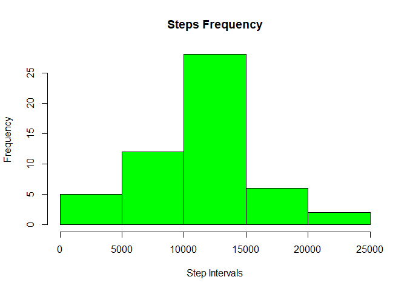
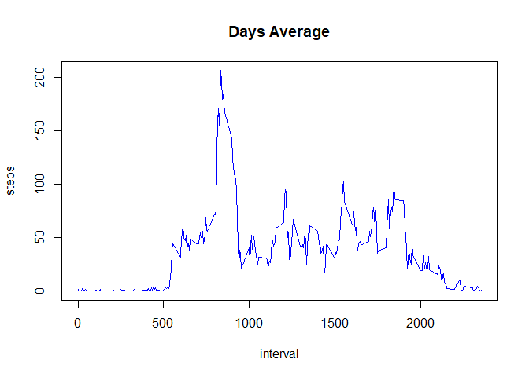
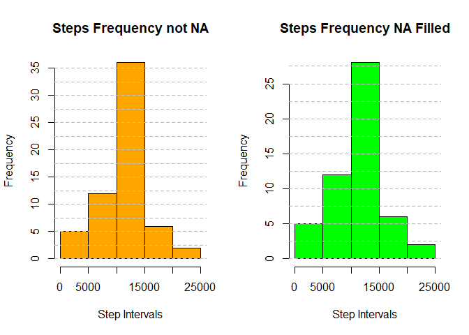
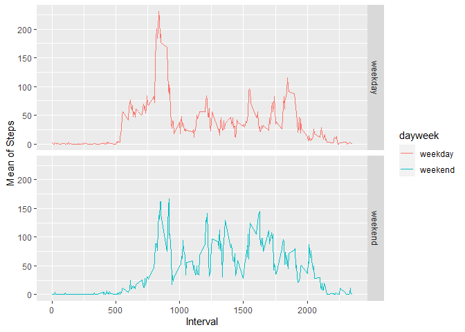

## Loading and preprocessing the data

Unzip

```r
unzip("activity.zip")
```
Read csv file

```r
act <- read.csv("activity.csv")
```
Check data

```r
head(act)
```

```
##   steps       date interval
## 1    NA 2012-10-01        0
## 2    NA 2012-10-01        5
## 3    NA 2012-10-01       10
## 4    NA 2012-10-01       15
## 5    NA 2012-10-01       20
## 6    NA 2012-10-01       25
```

```r
summary(act)
```

```
##      steps            date              interval     
##  Min.   :  0.00   Length:17568       Min.   :   0.0  
##  1st Qu.:  0.00   Class :character   1st Qu.: 588.8  
##  Median :  0.00   Mode  :character   Median :1177.5  
##  Mean   : 37.38                      Mean   :1177.5  
##  3rd Qu.: 12.00                      3rd Qu.:1766.2  
##  Max.   :806.00                      Max.   :2355.0  
##  NA's   :2304
```

## What is mean total number of steps taken per day?

**Calculate the total number of steps taken per day**


```r
act_notNan <- act_notNan <- na.omit(act)
act_steps_day <- setNames(aggregate(x=act_notNan$steps, 
                                    by=list(act_notNan$date), sum), 
                 c("Date", "Total_Steps"))
```

**If you do not understand the difference between a histogram and a barplot, 
research the difference between them. Make a histogram of the total number 
of steps taken each day**


```r
hist(act_steps_day$'Total_Steps', 
     col = "green", main="Steps Frequency", xlab = "Step Intervals")
```



**Calculate and report the mean and median of the total number of steps taken 
per day**


```r
mean(act_steps_day$Total_Steps)
```

```
## [1] 10766.19
```

```r
median(act_steps_day$Total_Steps)
```

```
## [1] 10765
```

## What is the average daily activity pattern?

**Make a time series plot (i.e. type = "l") of the 5-minute interval (x-axis) 
and the average number of steps taken, averaged across all days (y-axis)**


```r
library(Hmisc)
act_mean <- aggregate(steps ~ interval, data = act_notNan, mean)
with(act_mean, plot(interval, steps, type="l", col="blue", main="Days Average"))
minor.tick(nx = 10, ny = 5, tick.ratio = 0.5)
abline(v = seq(0, 2500, 100), lty = 2, col = "gray")
abline(h = seq(0, 210, 10), lty = 2, col = "gray")
```

<!-- -->

**Which 5-minute interval, on average across all the days in the dataset, contains 
the maximum number of steps?**


```r
subset(act_mean$interval, act_mean$steps == max(act_mean$steps))
```

```
## [1] 835
```

## Imputing missing values

**Calculate and report the total number of missing values in the dataset (i.e. the 
total number of rows with NAs)**

```r
sum(!complete.cases(act))
```

```
## [1] 2304
```

**Devise a strategy for filling in all of the missing values in the dataset. 
The strategy does not need to be sophisticated. For example, you could use the 
mean/median for that day, or the mean for that 5-minute interval, etc.**

To decide the best strategy keep in mind that:

- Can't drop rows because may introduce bias into some calculations or summaries of the data.
- All NA values are in the steps column.
- NA are found in all intervals of the same date.

So, I decided to use the mean for that 5-minute interval.


**Create a new dataset that is equal to the original dataset but with the missing 
data filled in.**


```r
act_fill <- act

act_inter <- setNames(aggregate(
        x=act_notNan$steps, by=list(act_notNan$interval), mean), 
        c("Interval", "Steps_mean"))


for(int in act_inter$Interval){
        step <- act_inter$Steps_mean[act_inter$Interval == int]
        act_fill$steps[is.na(act_fill$steps) & act_fill$interval == int] <- step
}

summary(act_fill)
```

```
##      steps            date              interval     
##  Min.   :  0.00   Length:17568       Min.   :   0.0  
##  1st Qu.:  0.00   Class :character   1st Qu.: 588.8  
##  Median :  0.00   Mode  :character   Median :1177.5  
##  Mean   : 37.38                      Mean   :1177.5  
##  3rd Qu.: 27.00                      3rd Qu.:1766.2  
##  Max.   :806.00                      Max.   :2355.0
```

**Make a histogram of the total number of steps taken each day and Calculate and 
report the mean and median total number of steps taken per day. Do these values differ from the estimates from the first part of the assignment? What is the impact of imputing missing data on the estimates of the total daily number of steps?**


```r
act_new_sd <- setNames(aggregate(x=act_fill$steps, by=list(act_fill$date), sum),
                       c("Date", "Total_Steps"))
```
Compare the two histograms

```r
par(mfrow=c(1,2))
hist(act_new_sd$Total_Steps,
     col = "orange", main="Steps Frequency not NA", xlab = "Step Intervals")
abline(h = seq(0, 35, 2.5), lty = 2, col = "gray")
hist(act_steps_day$'Total_Steps', 
     col = "green", main="Steps Frequency NA Filled", xlab = "Step Intervals")
abline(h = seq(0, 30, 2.5), lty = 2, col = "gray")
```



```r
mean(act_new_sd$Total_Steps)
```

```
## [1] 10766.19
```

```r
median(act_new_sd$Total_Steps)
```

```
## [1] 10766.19
```

After change nulls, the interval 10000 to 15000 has more frequency and the median
change to 10765.

## Are there differences in activity patterns between weekdays and weekends?

**Create a new factor variable in the dataset with two levels – “weekday” and 
“weekend” indicating whether a given date is a weekday or weekend day.**


```r
week <- weekdays(as.Date(act_fill$date))
dayweek <- factor(week, 
                  levels = c("lunes", "martes", "miércoles", "jueves", 
                             "viernes", "sábado", "domingo"), 
                  labels = c("weekday", "weekday", "weekday", "weekday", 
                             "weekday", "weekend", "weekend"))

act_fill_week <- cbind(act_fill, dayweek)
```

**Make a panel plot containing a time series plot (i.e. type = "l") of the 
5-minute interval (x-axis) and the average number of steps taken, averaged 
across all weekday days or weekend days (y-axis). See the README file in the 
GitHub repository to see an example of what this plot should look like using
simulated data.**


```r
aid <- aggregate(steps ~ interval + dayweek, data = act_fill_week, mean)
ggplot(aid, aes(x=interval, y=steps, color=dayweek)) + geom_line()+
        facet_grid(dayweek ~.) + xlab("Interval") + ylab("Mean of Steps")
```

<!-- -->


