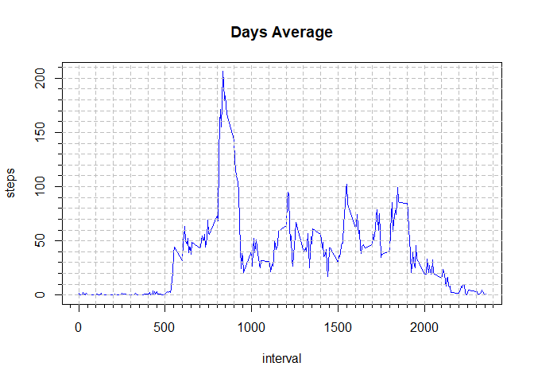

## Loading and preprocessing the data

Unzip

```r
unzip("activity.zip")
```
Read csv file

```r
act <- read.csv("activity.csv")
```
Check data

```r
head(act)
```

```
##   steps       date interval
## 1    NA 2012-10-01        0
## 2    NA 2012-10-01        5
## 3    NA 2012-10-01       10
## 4    NA 2012-10-01       15
## 5    NA 2012-10-01       20
## 6    NA 2012-10-01       25
```

```r
summary(act)
```

```
##      steps            date              interval     
##  Min.   :  0.00   Length:17568       Min.   :   0.0  
##  1st Qu.:  0.00   Class :character   1st Qu.: 588.8  
##  Median :  0.00   Mode  :character   Median :1177.5  
##  Mean   : 37.38                      Mean   :1177.5  
##  3rd Qu.: 12.00                      3rd Qu.:1766.2  
##  Max.   :806.00                      Max.   :2355.0  
##  NA's   :2304
```

## What is mean total number of steps taken per day?

Calculate the total number of steps taken per day


```r
act_notNan <- subset(act, !is.na(act$steps))
act_steps_day <- setNames(aggregate(
                          x=act_notNan$steps, by=list(act_notNan$date), sum), 
                 c("Date", "Total_Steps"))
```

If you do not understand the difference between a histogram and a barplot, 
research the difference between them. Make a histogram of the total number 
of steps taken each day


```r
hist(act_steps_day$'Total_Steps', 
     col = "green", main="Steps Frequency", xlab = "Step Intervals")
```

<!-- -->

Calculate and report the mean and median of the total number of steps taken 
per day


```r
mean(act_steps_day$Total_Steps)
```

```
## [1] 10766.19
```

```r
median(act_steps_day$Total_Steps)
```

```
## [1] 10765
```

## What is the average daily activity pattern?

Make a time series plot (i.e. type = "l") of the 5-minute interval (x-axis) 
and the average number of steps taken, averaged across all days (y-axis)


```r
act_mean <- aggregate(steps ~ interval, data = act_notNan, mean)
with(act_mean, plot(interval, steps, type="l", col="blue", main="Days Average"))
```

<!-- -->

Which 5-minute interval, on average across all the days in the dataset, contains the maximum number of steps?


## Imputing missing values


## Are there differences in activity patterns between weekdays and weekends?
